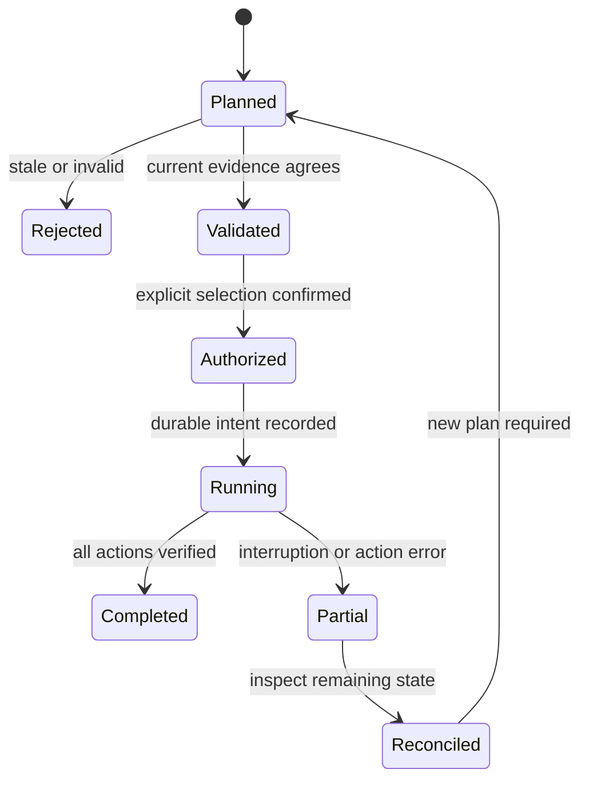

# Disk explainer — working specification v0.2

September 5, 2026. Working title; package names are not selected or reserved. Supersedes Aftermath as the chosen product direction. This is a specification, not an implemented or published package.

## Product

A local tool for humans and agents that answers: **What is using my disk, what grew, who owns it, and what happens if I remove it?**

Install through Cargo, pip or npm. Run one command without project integration. Readable terminal output by default; the same evidence and decisions as stable JSON for agents. No model, cloud account or inference cost required.

NEDB is a required product dependency: persist scan history, evidence and cleanup receipts locally, making changes between scans a first-class feature.

## Research and positioning

This market already has capable tools. Do not pitch a novel disk cleaner.

| Existing tool | Documented capability | Implication |
|---|---|---|
| [Dust](https://github.com/bootandy/dust) | Directory space overview, hard-link deduplication | Size ranking is baseline functionality |
| [dua](https://github.com/Byron/dua-cli) | Parallel disk analysis and interactive deletion | Fast scanning and deletion alone are insufficient |
| [Kondo](https://github.com/tbillington/kondo) | Cleans project dependencies and build outputs across many project types | Recognizing target and node_modules is not novel |
| [CleanMyMac CLI](https://github.com/MacPaw/cleanmymac-cli) | Developer-oriented cleanup tooling | Strong adjacent competition; compare supported workflows before claiming a gap |
| [MangoDisk](https://github.com/harry0703/MangoDisk) | Developer artifacts and container-cache cleanup | Safety and rebuildable-file recognition also have competition |
| [Docker system df](https://docs.docker.com/reference/cli/docker/system/df/) | Docker-owned usage, shared and unique image sizes | Use owner-reported data rather than scanning Docker internals |

Opportunity hypothesis: ownership evidence, removal consequences, and persistent growth history presented consistently to humans and agents. This short research sprint has not established an exclusive feature gap or willingness to pay. Validate convenience against existing tools, not just feature counts.

## First-use contract

Proposed executable placeholder: `diskwhy`. Final registry names require availability checks.

```sh
diskwhy scan ~/Projects
diskwhy explain <finding-id>
diskwhy diff --previous --root ~/Projects
diskwhy scan ~/Projects --json
diskwhy plan --select <finding-id> --out cleanup.json
diskwhy apply cleanup.json
```

`scan` writes only its own NEDB state; it does not change scanned files. First scan establishes a baseline and still provides ownership/consequence findings. `diff` reports a missing baseline honestly. `plan` is non-destructive. `apply` displays exact paths and consequences, and requires confirmation; noninteractive execution requires an explicit authorization flag and an unchanged validated plan. No default background service.

Example presentation, illustrative and not a measured scan:

| Finding | Owner evidence | Consequence | Growth |
|---|---|---|---|
| 8.2 GiB in project target | Cargo manifest and target layout | Next build regenerates outputs; dependencies/toolchain may be needed | +3.1 GiB since prior complete scan |
| 2.4 GiB in node_modules | Package manifest and lockfile | Reinstall dependencies; downloads and lifecycle scripts may be required | New since previous scan |
| 17 GiB model file | Recognized model metadata, origin unknown | Recovery source unverified; keep out of automatic cleanup | Unchanged |

## Scope and first release

Rust core and CLI. Linux and macOS first; Windows support follows once filesystem identity and deletion guarantees are verified. Registry distribution must state supported platforms explicitly.

1. Bounded parallel filesystem scan, largest consumers, progress, cancellation and incomplete-scan reporting.
2. Rust Cargo target, Node node_modules, and Python __pycache__ detection using corroborating project metadata. Recognize virtual environments but classify restoration as conditional.
3. Local GGUF/model-file inventory, with known owner/reference metadata where available. A file extension does not prove replaceability. Model cleanup remains manual in v0.1.
4. Explain findings with owner, evidence, confidence, recovery requirements, and storage accounting uncertainty.
5. NEDB scan history and comparisons.
6. Reviewable plans and explicit cleanup for narrowly supported artifact classes after destructive-action gates pass.

Docker and package-manager shared-cache adapters are next. Initially report unsupported paths as unknown. Later query Docker through its CLI/API; do not delete its internal files. Shared caches require owner-native operations with explicit scope. No duplicate-content hashing, automatic model eviction, broad system cleanup, cloud dashboards or autonomous scheduled deletion in v0.1.

## Core architecture

Rust workspace: scanner, detectors, storage adapter, planner/executor, CLI. Module boundaries can start in one crate; avoid needless fragmentation. NEDB uses its embedded Rust API through a narrow adapter. Verify the actual API, transaction semantics and available release before coding; do not invent API names or assume atomic multi-record writes.

Scanner emits observations; detectors attach evidence; accounting computes non-overlapping totals; planner produces immutable action descriptions; executor revalidates and records outcomes. Human and JSON output share the same result objects. Detection uses deterministic rules, not an LLM. Never run project scripts or load project-controlled executable configuration during scans.

### NEDB data model

| Logical collection | Key | Stored facts |
|---|---|---|
| scans | scan_id | Root identity, start/end, platform, scope/config hash, exclusions, status, counts, coverage errors |
| observations | scan_id + entry_id | Path, file identity, type, logical/allocated bytes, timestamps, link count, read status |
| findings | scan_id + finding_id | Owner, category, evidence refs, confidence, consequence, accounting quality |
| plans | plan_id | Selected finding revisions, paths, identity preconditions, action scope, estimates, digest |
| cleanup_events | event_id | Intent, started/completed/partial status, per-entry outcomes, plan reference, before/after measurements |

These are application-level records; map them to the supported NEDB interface during implementation. Mark scans complete only after their records are durably available. A completion marker prevents partial scans becoming authoritative baselines. Persist history through new events rather than rewriting historical conclusions. Use NEDB history/changefeed features only after checking their real contracts.

Diff only comparable scopes; changed exclusions, inaccessible directories and incomplete scans must not appear as mass deletion. Stable file identity helps distinguish moves from new allocations where the OS exposes it, but identity reuse and cross-volume moves can remain ambiguous. Report that ambiguity.

Default state lives in the OS application-state directory. Bound retention by age/count and expose `history prune`. NEDB's own footprint is reported separately and excluded from recursive history growth. Do not assume deleting logical records physically compacts the database; verify and document supported reclamation behavior. Store metadata, not file contents or secrets. No background uploads.

## Filesystem accounting contract

Track logical size and allocated size separately. Count hard-linked allocations once by filesystem identity. A selected deletion set can only reclaim an inode's blocks when all links are removed; links outside the scanned scope make that estimate uncertain. De-duplicate parent/child selections before summing.

Sparse files, compression, snapshots, clones/reflinks and open deleted files prevent a universal exact reclaimable number. Report reclaimable bytes as an estimate or unknown, with evidence and limitations. Never promise allocated bytes equal immediately freed volume space. Do not sum Docker logical image sizes into host filesystem totals.

Do not follow symlinks by default; stop at mount boundaries unless requested. Handle permission errors and disappearing files as explicit partial coverage. Modification time is not last-use time; never infer that an old build directory is unused solely from mtime.

## Cleanup contract

Recognized does not mean disposable. Distinguish likely rebuildable, requires download/setup, potentially unique and unknown. Explain recovery prerequisites; a lockfile does not guarantee upstream packages remain available.

- Plans select explicit supported artifact roots. Source files, .git, user documents and unknown model origins are outside automatic actions.
- Detect tracked/custom content where feasible; downgrade or block ambiguous candidates. Directory names alone never authorize removal.
- Check active-use signals where available, but absence is not proof of inactivity. Ask users to stop builds before applying plans.
- Revalidate file identities, detector evidence and relevant metadata at application time. Reject changed plans and changes in authorization scope.
- Use platform-aware no-follow traversal and identity checks. If race-resistant traversal cannot be implemented on a platform, withhold destructive mode there. Rechecking a path once does not solve symlink races.
- Prefer owner-native cleanup only when its entire scope matches the approved plan; execute argv directly, never interpolate shell strings.
- Record intent before mutation and per-action results afterward. Database records and filesystem deletion are not one transaction. A crash leaves an unresolved receipt that startup reconciles from observed filesystem state; never report deletion as complete merely because it was planned.
- Permanent deletion has no automatic undo. Trash/quarantine is a separate optional action and must not be advertised as immediately reclaimed space on the same volume.
- Measure volume free-space before/after as an observed delta affected by concurrent activity, not an exact attribution guarantee.

## Agent interface

Versioned JSON schema with scan status, scope, findings, evidence, accounting confidence and structured errors. IDs reference persisted observations. Paths must round-trip on supported platforms, including non-UTF-8 Unix names through an explicit encoded representation. Unknown sizes are null with reasons, never zero.

Exit codes: 0 complete successful operation, 1 operational error, 2 incomplete scan or stale/rejected plan, 3 user cancellation. Machine output goes to stdout; progress to stderr. `--json` never implicitly approves cleanup. A reusable Rust API exposes the same domain objects; Python/JavaScript wrappers invoke the binary and parse JSON first.

## Distribution

Publish Rust core/CLI to crates.io, platform wheels plus launcher to PyPI, and thin platform-binary launchers to npm. One Rust engine owns scanning, NEDB storage and verdicts. CI handles build matrices, checksums, installation smoke tests and publishing; it must preserve version parity and track partial registry failures without replacing already-published bytes. No Rust compiler required for supported pip/npm installs. Check licenses and native dependencies when selecting the NEDB version.

## Proof and acceptance gates

1. Fixtures establish correct ownership and consequences for supported artifact types and ensure misleading directory names stay unknown.
2. Hard links are not double-counted; external links, sparse files and unsupported clone accounting produce appropriate uncertainty.
3. Permission failures and cancellation cannot yield a complete baseline or false growth/deletion claims.
4. A scan, controlled file growth, restart and second scan produce a correct NEDB-backed diff and explainable evidence.
5. Stale plans, swapped symlinks, protected contents and changed identities cannot delete outside the approved scope.
6. Interrupted cleanup preserves partial receipts and honest recovery state.
7. Humans and JSON consumers receive equivalent findings; all three distributions pass the same normalized fixtures.
8. Compare scan time and memory with an established analyzer on the same trees, publishing machine specs and cold/warm conditions. No speed claims until measured.

## Build order and product validation

First deliver a read-only vertical slice: real Rust/Node artifact recognition, disk accounting, NEDB persistence, human output and JSON. Then add history comparison and explanation. Implement plans and narrowly scoped execution only after meaningful safety tests pass. Package through all three registries with CI.

First demo: scan a development folder, explain its largest supported artifacts, make a controlled build-output change, scan again and show the NEDB-backed growth explanation. Cleanup demonstration uses disposable fixture files.

Ask five developers to use it on their own machines without integration work. Proceed if it helps at least three confidently identify a worthwhile cleanup or explain unexpected growth, and at least two use it again. These are proposed validation gates, not existing traction. Compare their workflow directly with Kondo, dua and developer-oriented cleaners. If history and explanations do not materially improve decisions, narrow to a reusable detector/history library or stop expanding features.

## Detailed implementation decisions — v0.2 expansion

### Verified NEDB surface

The published documentation inspected on September 5 identifies `nedb-engine` 2.8.5 and exports `Db`. Its documented API includes `open`, `put`, `get`, `get_by_hash`, `get_as_of`, `trace`, `tip_collection` and `since`. `put_batch` performs independent writes rather than documenting an atomic transaction. `delete` retains historical objects. `compact` applies to the v3 substrate and prunes superseded versions. The docs describe buffered persistence, explicit `flush_all`, startup readiness and historical changefeed readiness. These are documentation findings, not a runtime audit. [Crate overview](https://docs.rs/nedb-engine/latest/nedb_engine/) · [Db API](https://docs.rs/nedb-engine/latest/nedb_engine/db/struct.Db.html)

Use this as the initial API baseline, then pin a tested version. The repository could not be fetched in this research environment. Source review and a compiled storage spike remain implementation gates, especially around fsync/error propagation. Never infer power-loss guarantees from a method name or successful in-process readback.

### Application-owned persistence protocol

The following is our proposed design, not an assertion that NEDB implements these transactions for us.

- Single application writer owns the local database under an OS process lock. Until concurrent cross-process behavior is verified, even history queries coordinate through that lock; return a useful busy error rather than corrupting state. Threads inside the process may scan concurrently.
- Write a unique scan-start record, then bounded batches of observations and findings. Check every returned result. Compute a manifest containing record counts and hashes of persisted batch descriptors.
- Finish writes and establish the verified durability boundary before publishing a unique scan-completion record. Durably publish that record before updating a replaceable latest-complete pointer. Treat the pointer as a cache; recover it from valid completion records.
- On reopening, validate completion manifests and expected record counts before accepting a baseline. Incomplete writes are retained as incomplete until explicit retention cleanup.
- Do not write filesystem deletion intents unless their persistence succeeds. Before destructive release, review whether the storage layer can report durability errors. If it cannot, keep cleanup disabled until that contract is corrected; scanning can still ship.
- Store one immutable logical document per completed observation/finding/event, with scan_id and stable IDs. That makes retained scan history explicit application data rather than relying solely on overwritten document versions.
- Use hash references for explanations: observations → finding → plan → cleanup event. The edge records the reasoning/input dependency; it does not establish which external process created a file.
- Keep wall-clock observation intervals separate from database ordering. NEDB sequence identifies record order; scan timestamps identify when evidence was observed. A live filesystem scan is not an atomic filesystem snapshot.
- Full-disk behavior: if persistence runs out of space, terminate the scan as incomplete and emit the findings already available with `persisted: false` where appropriate. Never silently lose history while claiming a durable scan. An explicit `scan --ephemeral` escape hatch uses in-memory state, performs no cleanup and announces that no baseline will be saved.

### Retention and storage budget

Initial product defaults: keep the last 10 complete scans per root, with a configurable 30-day age limit; keep the latest complete baseline even if older unless the user explicitly prunes it. Pin scans referenced by unresolved cleanup receipts. Expose history size and a configurable 512 MiB soft budget; these are starting design values requiring measurement.

Avoid a full unbounded collection materialization to compare million-file scans. Store observations in deterministic path-prefix or hash shards, bound batch sizes, and sort/join shard streams. Validate that the chosen NEDB access path can read bounded shards; a full-collection Vec API is unsuitable as the only large-scan query path. A storage spike must select between per-shard collections, paged queries or packed bounded observation documents. Do not bypass NEDB with a hidden parallel database.

Retire expired scan IDs and their live observation records through a reviewed history-prune operation. Physical storage reclamation needs a separately tested path that preserves all retained scans and receipts. Do not run global compaction blindly. An alternative is a generation rewrite: copy retained live records to a fresh database, validate manifests, flush, switch an application-owned generation pointer atomically, and retain the old generation until successful reopen. This can require substantial temporary space and cannot be the only full-disk escape route.

### Detector contract and evidence levels

Each detector returns category, owner candidates, evidence, consequence, cleanup eligibility and a rule version. Explain exactly which facts supported the classification. Use qualitative evidence levels rather than invented percentage confidence.

| Detector | Positive evidence | Cases to downgrade or exclude | Recovery explanation |
|---|---|---|---|
| Cargo target | Nearby Cargo.toml, conventional layout and expected build metadata | Custom target location, mixed content, tracked files, active builds | Build again with toolchain/dependencies; artifacts may be unique to an unavailable build environment |
| Node dependencies | package.json, package-manager lockfile and package layout | Locally patched dependencies, linked/workspace packages, missing private registry access | Reinstall may require network/authentication and rerun install scripts |
| Python bytecode | __pycache__ structure and matching source | Bytecode-only distributions or missing source | Interpreter regenerates bytecode where source and compatible runtime remain available |
| Virtual environment | pyvenv.cfg plus project metadata | No dependency manifest, editable installs, unmanaged packages | Recreate only if environment requirements are known; otherwise manual review |
| Model file | Valid bounded GGUF header parsing and optional owner catalog reference | Arbitrary extension, unknown origin, active reference or custom fine-tune | Download again only when source and exact identity are known; otherwise potentially unique |

Parse manifests as inert data with size/depth limits. Never execute build scripts to classify a directory. Prefer the nearest corroborated project boundary; workspace roots may own multiple packages. Return multiple owner candidates if ambiguous. “Not referenced by the metadata we checked” must not become “unused.”

### Ranking and explanation

Default ranking: largest allocated consumers within measured coverage. Optional `--sort growth` ranks comparable positive deltas. Optional `--sort reclaimable` ranks only supported estimates, keeping unknowns visible separately. Do not hide a large unknown file merely because there is no cleanup recipe.

A useful explanation contains five facts in order: measured size; owner and evidence; observed change; removal consequence; next action. Keep detailed source hashes and rule IDs in expanded output/JSON. Do not call an explanation causal unless execution or owner telemetry directly supports that assertion.

Never aggregate the same blocks twice across nested findings. For presentation, list an artifact root as one candidate and keep descendants as drill-down evidence. Hard-linked files can have multiple path owners while their allocation belongs to one accounting group. Track those concepts separately.

### Configuration and interface examples

Proposed config, stored under the OS user configuration directory:

```toml
schema_version = 1
roots = ["~/Projects"]
exclude = ["**/.git/**"]
cross_filesystems = false
follow_symlinks = false

[history]
keep_complete_per_root = 10
max_age_days = 30
soft_budget_mib = 512

[scan]
workers = 4
metadata_batch_size = 512
```

These are initial defaults, not benchmark-derived optimal settings. Environment and CLI overrides are recorded in the scope hash. Explain excluded space: the project .git exclusion means reported usage is scoped, not the whole project's physical total. A user may include it for read-only measurement without enabling cleanup there.

Proposed JSON finding (illustrative):

```json
{
  "schema_version": 1,
  "scan_id": "scan_example_002",
  "finding_id": "finding_example_004",
  "path": {"display": "/home/dev/app/target", "encoding": "utf8", "value": "/home/dev/app/target"},
  "category": "rust.build_output",
  "owner": {"kind": "cargo_project", "root": "/home/dev/app", "confidence": "corroborated"},
  "size": {"logical_bytes": "8804682956", "allocated_bytes": "8796094464", "reclaimable_bytes": null, "reclaimable_quality": "unknown", "reason": "shared_extent_accounting_unavailable"},
  "change": {"baseline_scan_id": "scan_example_001", "logical_delta_bytes": "3221225472", "comparable": true},
  "consequence": {"class": "conditional_rebuild", "summary": "Next build regenerates outputs; toolchain and dependencies required."},
  "evidence": [{"kind": "manifest", "path": "/home/dev/app/Cargo.toml", "node_hash": "illustrative-only"}],
  "cleanup": {"eligible": false, "reason": "active_use_not_reviewed"}
}
```

Represent byte counters and potentially large signed deltas as decimal strings to preserve exact integers across JavaScript consumers. Use JSON null for unknown facts. API consumers must not parse the human explanation to decide eligibility.

### Plan identity, validation and authorization

A plan includes its schema version, ID, creation/expiry time, root identities, source scan and detector versions, selected actions, exact path identities, preconditions, estimate quality, and canonical digest. Default expiry is 24 hours, but current validation is required even before expiry. A digest detects accidental changes; it is not an authorization signature.

Interactive `apply` previews the current validated action set. Noninteractive callers must pass `--approve-plan <digest>` matching the displayed plan and an explicit execution option; a generic JSON output flag cannot approve anything. Do not expand globs, infer additional siblings, or substitute a broader owner-native cleanup command during execution. Any widened scope needs a newly generated plan.

The program cannot fully defend against another process with the same user privileges deliberately manipulating state. It must protect against normal concurrent changes and avoid crossing approved filesystem boundaries. Report the remaining platform limitations rather than claiming invulnerability.

### State transitions



Recovery inspects state without repeating a destructive action automatically. An absent path after restart is an observed absence, not proof that this process deleted it. A later plan may continue remaining work after fresh validation and authorization.

### Adversarial and boundary test matrix

| Fixture | Expected behavior |
|---|---|
| Directory called target containing tracked source | No automatic cleanup eligibility |
| Symlink points outside selected root | Record link; do not descend or delete target |
| Symlink/parent replacement during apply | Refuse or stop without outside-root deletion |
| One inode with selected and unselected hard links | No full-allocation reclaim promise |
| Parent and descendant both selected | One normalized action scope, no doubled totals |
| Permission denied only on second scan | Coverage loss, not fabricated deletion |
| Directory renamed between scans | Move when identity evidence supports it; otherwise uncertain |
| Root mounted to a different device | Baseline incompatibility reported |
| File grows while scanning | Report observation interval and unstable entry where detected |
| State directory is inside scanned root | Exclude own state and report that exclusion |
| Invalid UTF-8 filename or terminal control characters | Lossless encoded path; escaped display; no terminal injection |
| Huge or malicious manifest | Bounded parsing; detector error, no execution |
| Database unavailable or ENOSPC | No cleanup without durable intent; incomplete/ephemeral scan clearly labeled |
| Process killed after each persistence boundary | Reopen without accepting incomplete baseline |
| Process killed after some deletions | Partial receipt; no automatic destructive replay |
| Two CLI processes | Defined locking/busy behavior |
| User cancels scan | Responsive cancellation and incomplete scan marker |
| Retention removes old scan | Retained manifests and receipt references remain valid |
| Package installed through each registry | Same binary behavior and normalized JSON |

### Delivery milestones with proof

| Milestone | Deliverable | Demonstration required to call it done |
|---|---|---|
| M0: storage contract | Pinned NEDB dependency, adapter and crash/retention spike | Write, kill at controlled points, reopen; distinguish complete versus incomplete records; document durability limits |
| M1: useful first run | Scanner, Rust/Node detectors, human table and JSON | Point at a disposable mixed project tree; correct bytes, owners, unknowns and consequences |
| M2: history | NEDB scans, compare, explain and retention | Controlled growth and rename across process restarts; evidence resolves to original observations |
| M3: cleanup | Plan, validation, explicit execution and receipts | Supported artifact cleanup plus adversarial path tests; demonstrate partial failure recovery |
| M4: distribution | crates.io/PyPI/npm packages and CI workflow | Clean installs on supported platforms; shared fixture suite; version and checksum parity |
| M5: adoption check | Short user trial and comparison notes | Real users obtain a useful answer with one command and return for history comparisons |

Do not attach day estimates until M0 resolves storage integration and M1 measures scanner costs. Progress is defined by demonstrable behavior, not code volume. Publish read-only capability as an early prerelease if cleanup gates need more work, clearly separating supported commands.

### Performance and NEDB dogfood report

Measure directories/files per second, first-result latency, total scan latency, peak RSS, bytes written to NEDB, restart latency, history-diff time and retained-history amplification. Test 10k, 100k and 1m-entry generated trees with documented file-size/layout distributions. Run both warm and cold conditions where controllable. Include a slow/network filesystem only as a separately labeled scenario.

The storage budget is a first-class metric: a disk-space utility that accumulates excessive metadata fails its own purpose. File every reproducible NEDB correctness or performance issue discovered during implementation with a minimal fixture, expected/actual behavior and version. Do not mask engine limitations by silently switching to SQLite. An application index/cache may accelerate reads, but NEDB remains authoritative and the cache must be rebuildable.

## Open decisions and explicit nonclaims

- Working name and registry namespace availability remain unverified.
- Exact Rust dependency versions, MSRV, binary size, licensing and supported CPU/OS minimums require the implementation lockfile and CI.
- NEDB runtime durability and retention behavior must be tested; documentation review is insufficient for destructive guarantees.
- No benchmark, adoption result, recovered-space measurement or publication has occurred in this task.
- Growth history is observational. Identifying the writing process requires optional owner telemetry or future tracing, outside initial scope.
- Competitors have overlapping features. The proposed advantage is a coherent local workflow and evidence history, to be validated directly.
